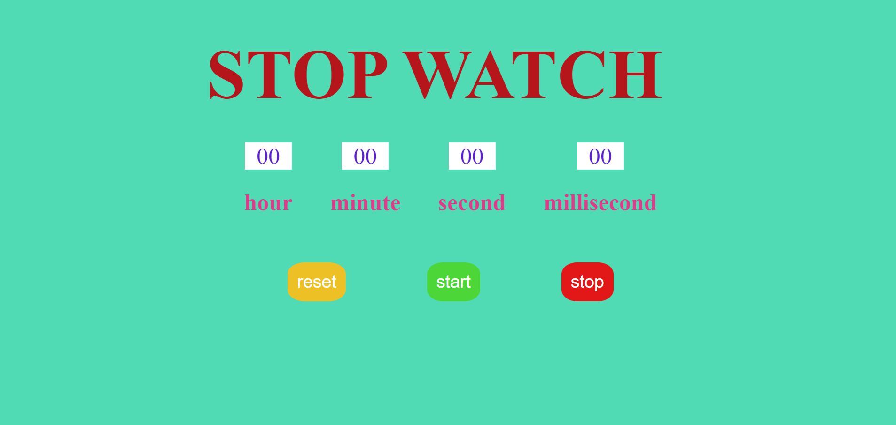
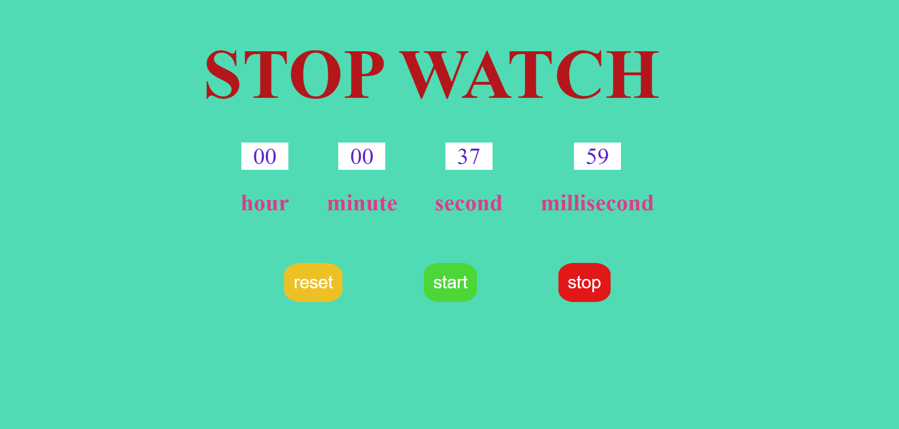

## What to build

we have to build STOPWATCHAPP.

## Input

## Techanology used

we have used HTML, CSS and JavaScript DOM

## What I have learned from this project

I have learned how to use setInterval for generating milliSecond and converting millisecond in seconds, minutes and hours and display them on page which makes a StopWatch App.

## Output

### Instructor

**Hitesh choudhary**
